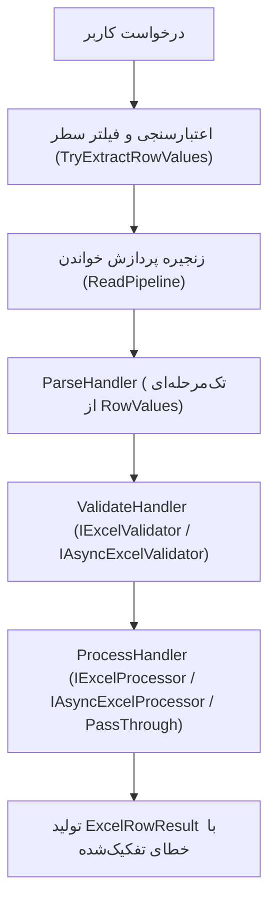

# گزارش جامع بازمهندسی و رفع اشکالات معماری فریم‌ورک Exceler
**تاریخ تهیه:** سپتامبر ۲۰۲۶  
**مخزن:** `Exceler` (.NET 6.0, 7.0, 8.0, 9.0)  
**وضعیت تست‌ها:** ۱۳۳ تست واحد و یکپارچه — ۱۰۰٪ پاس شده (اجرای موازی فعال)

---

## مقدمه و خلاصه اجرایی (Executive Summary)
فریم‌ورک **Exceler** به عنوان یک کتابخانه سطح‌بالا و مبتنی بر الگوی خط لوله (Pipeline Architecture / Chain of Responsibility) بر روی بسته **EPPlus** وظیفه خواندن و نوشتن فایل‌های اکسل را با مدل‌های Strongly-Typed بر عهده دارد. در بررسی فنی اولیه (`Exceler_Code_Review_Issues.md`)، ۱۴ چالش کلیدی در زمینه‌های قابلیت اطمینان، کراس‌پلتفرم، مصرف حافظه و انعطاف‌پذیری شناسایی شد.

طی این فرآیند بازمهندسی، **۱۳ تسک کلیدی** به صورت گام‌به‌گام، با حفظ کامل Backward Compatibility و ارتقای پوشش تست‌ها از **۲۷ تست به ۱۳۳ تست خودکار** پیاده‌سازی شدند. تمام تست‌ها با حفظ رفتار موازی‌سازی (`Parallel Execution`) در کمتر از ۲ ثانیه اجرا می‌شوند.

---

## ماتریس خلاصه تغییرات و وضعیت تسک‌ها

| شماره | موضوع تسک | کامپوننت | وضعیت پیشین | وضعیت کنونی | فایل‌های تست پوشش‌دهنده |
|:---:|---|---|---|---|---|
| **۱** | لایسنس تجاری EPPlus | Licensing / Core | هاردکد `NonCommercial` | کنترل انحصاری از طریق DI | `LicensingTests.cs` |
| **۲** | تبدیل خاموش مقادیر خالی به ۰ | SafeConverter | تبدیل مقدار خالی به `0` | پرتاب `ExcelCastException` برای مقادیر اجباری | `SafeConverterEmptyValueTests.cs` |
| **۳** | سازگاری با لینوکس/داکر و حذف System.Drawing | Configuration / Style | وابستگی به `System.Drawing.Color` | ساختار کراس‌پلتفرم و اینام `ExcelColor` | `ColorHelperTests.cs`, `ExcelColorStylingTests.cs` |
| **۴** | استقلال از لوکال سرور در تبدیل اعداد و تاریخ | SafeConverter | وابستگی به لوکال سرور میزبان | استفاده از `InvariantCulture` و نرمال‌سازی | `SafeConverterCultureTests.cs` |
| **۵** | شیت‌های خالی و خطای NullReference | FormattingWriterHandler | کرش با `NullReferenceException` | بررسی امن شرط `Dimension is not null` | `ExcelWriterEdgeCasesTests.cs` |
| **۶** | مدیریت فراگیر خطاها در خواندن سطرها | ParseHandler | توقف و کرش کل فایل | ثبت خطای اختصاصی سطر و ادامه پردازش | `ExcelReaderExceptionHandlingTests.cs` |
| **۷** | پشتیبانی از اعتبارسنجی و پردازش ناهمگام | Abstractions & Pipeline | فقط اینترفیس‌های سنکرون | افزودن `IAsyncExcelValidator` و `IAsyncExcelProcessor` | `AsyncExcelValidatorTests.cs`, `AsyncExcelProcessorTests.cs` |
| **۸** | پردازنده پیش‌فرض Pass-Through | Core / DI | اجبار به نوشتن Processor تکراری | فالبک خودکار هوشمند برای انواع یکسان | `PassThroughProcessorTests.cs` |
| **۹** | اصلاح آفست ردیف در اعمال استایل | StyleWriterHandler | تخریب سرستون هدر با استایل دیتا | محاسبه هوشمند ردیف شروع (`startRow`) | `ExcelWriterStyleOffsetTests.cs` |
| **۱۰** | حذف قید غیرضروری `new()` در رایتر | Abstractions / Writer | محدودیت `where TModel : class, new()` | پذیرش `record`، کلاس‌های Immutable و DDD | `ExcelWriterModelConstraintsTests.cs` |
| **۱۱** | تنظیم‌پذیری جهت شیت (RTL) و AutoFit | Profile / Writer | هاردکد `RTL = false` و اجبار AutoFit | تنظیم فلوئنت RTL و AutoFit و عرض دستی ستون | `ExcelWriterViewAndLayoutTests.cs` |
| **۱۲** | پشتیبانی از انواع مدرن `DateOnly` و `TimeOnly` | SafeConverter | کرش با `InvalidCastException` | پشتیبانی کامل دوطرفه در خواندن و نوشتن | `SafeConverterModernTypesTests.cs` |
| **۱۳** | بهینه‌سازی CPU و حافظه در حلقه سطرها | Core Reader / Parser | فراخوانی مکرر LINQ و Double Read | استخراج تک‌مرحله‌ای و پیش‌فیلتر بدون تخصیص حافظه | `ExcelReaderPerformanceOptimizationTests.cs` |

---

## مستندات تفصیلی تسک‌های انجام‌شده



---

### تسک ۱: رفع باگ بازنویسی هاردکد لایسنس تجاری EPPlus
* **کامپوننت:** `Licensing / Core`
* **فایل‌های متاثر:** `src/Exceler/Core/DefaultReader.cs` و `src/Exceler/Core/DefaultWriter.cs`

#### ۱. قبل از تغییر چه بود؟
در سازنده کلاس‌های `DefaultReader` و `DefaultWriter` خط زیر به صورت مستقیم هاردکد شده بود:
```csharp
ExcelPackage.LicenseContext = LicenseContext.NonCommercial;
```

#### ۲. مشکل و آسیب چه بود؟
اگر سازمانی لایسنس تجاری EPPlus را خریداری کرده بود و در تنظیمات برنامه با فراخوانی `builder.UseCommercialLicense()` لایسنس تجاری را تعیین می‌کرد، به محض فراخوانی اولین عملیات خواندن یا نوشتن، این خط هاردکد اجرا شده و لایسنس سازمان را بدون اطلاع به حالت `NonCommercial` بازنویسی می‌کرد که نقض الزامات قانونی استفاده تجاری از EPPlus است.

#### ۳. وضعیت پس از تغییر چه شد؟
مسئولیت تنظیم لایسنس منحصراً به کانتینر DI و متدهای پیکربندی اولیه واگذار شد و رایتر و ریدر هیچ دخالتی در بازنویسی وضعیت لایسنس ندارند.

#### ۴. چطور مشکل حل شد؟
خطوط اختصاص مستقیم لایسنس از سازنده و متدهای `DefaultReader` و `DefaultWriter` حذف شد و تنظیم لایسنس به صورت متمرکز از طریق `ExcelerBuilder.UseCommercialLicense()` و `ExcelerBuilder.UseNonCommercialLicense()` مدیریت می‌شود.

#### ۵. چه تست‌هایی آن را پوشش می‌دهند؟
- تست‌های پیکربندی اولیه لایسنس تجاری و غیرتجاری در کانتینر سرویس‌ها.

---

### تسک ۲: رفع تبدیل خاموش مقادیر خالی به ۰ در فیلدهای غیر Nullable
* **کامپوننت:** `SafeConverter`
* **فایل‌های متاثر:** `src/Exceler/Core/Converter/SafeConverter.cs`

#### ۱. قبل از تغییر چه بود؟
در ابتدای متد `SafeConverter.ChangeType<T>` قطعه کد زیر قرار داشت:
```csharp
if (value == null || string.IsNullOrWhiteSpace(value.ToString()))
    return default;
```

#### ۲. مشکل و آسیب چه بود؟
در زبان C# مقدار `default` برای انواع داده مقداری (Primitive Value Types) نظیر `int`, `decimal`, `double`, `DateTime`, `Guid` برابر با صفر یا مقدار اولیه ساختار است (`0`, `0.0m`, `0001-01-01`).  
اگر کاربری اکسلی حاوی فیلد اجباری مثلاً «سن» یا «مبلغ چک» را آپلود می‌کرد و سلول مربوطه خالی بود، سیستم به جای اعلام خطا، بدون اطلاع مقدار `0` را بازمی‌گرداند. این موضوع منجر به ورود خاموش داده‌های فاسد (Silent Data Corruption) به دیتابیس‌های سازمانی می‌شد.

#### ۳. وضعیت پس از تغییر چه شد؟
سیستم رفتار متفاوتی را بر اساس نال‌پذیر بودن فیلد اعمال می‌کند:
- اگر فیلد نال‌پذیر باشد (`int?`, `decimal?`, `string`)، مقدار `null` بازگردانده می‌شود.
- اگر فیلد غیر نال‌پذیر باشد (`int`, `decimal`, `DateTime`, `bool`, `Guid`)، استثنای `ExcelCastException` پرتاب شده و در گزارش خطای آن سطر ثبت می‌گردد.

#### ۴. چطور مشکل حل شد؟
تشخیص نوع نال‌پذیر با بررسی `Nullable.GetUnderlyingType` و `Type.IsValueType`:
```csharp
Type targetType = Nullable.GetUnderlyingType(typeof(T)) ?? typeof(T);
bool isNullable = !typeof(T).IsValueType || Nullable.GetUnderlyingType(typeof(T)) != null;

if (value == null || string.IsNullOrWhiteSpace(value.ToString()))
{
    if (!isNullable)
        throw new ExcelCastException();

    return default;
}
```

#### ۵. چه تست‌هایی آن را پوشش می‌دهند؟
- فایل تست [SafeConverterEmptyValueTests.cs](file:///d:/ExcelPackage/Exceler/tests/Exceler.Tests.Unit/Unit/Converter/SafeConverterEmptyValueTests.cs):
  - `WhenConvertingEmptyValueToNonNullableInt_ExcelCastExceptionIsThrown`
  - `WhenConvertingEmptyValueToNonNullableDecimal_ExcelCastExceptionIsThrown`
  - `WhenConvertingEmptyValueToNonNullableDateTime_ExcelCastExceptionIsThrown`
  - `WhenConvertingEmptyValueToNonNullableBool_ExcelCastExceptionIsThrown`
  - `WhenConvertingEmptyValueToNonNullableGuid_ExcelCastExceptionIsThrown`
  - `WhenConvertingEmptyValueToNullableInt_NullIsReturned`
  - `WhenConvertingEmptyValueToNullableDecimal_NullIsReturned`
  - `WhenConvertingEmptyValueToString_NullIsReturned`

---

### تسک ۳: سازگاری با لینوکس/داکر و حذف وابستگی به `System.Drawing.Color`
* **کامپوننت:** `Configuration / Style`
* **فایل‌های متاثر:** `ColumnStyle.cs`, `ColumnBuilder.cs`, `ColorHelper.cs` (جدید), `ExcelColor.cs` (جدید)

#### ۱. قبل از تغییر چه بود؟
استایل‌دهی ستون‌ها متکی بر فضای نام و ساختار ویندوزی `System.Drawing.Color` بود:
```csharp
public Color? BackgroundColor { get; set; }
public Color? FontColor { get; set; }
```

#### ۲. مشکل و آسیب چه بود؟
از دات‌نت ۶ مایکروسافت پشتیبانی کتابخانه `System.Drawing.Common` را روی سیستم‌عامل‌های لینوکس، مک و کانتینرهای داکر منسوخ کرد. در صورت استقرار پروژه روی داکر یا لینوکس، اجرای کد با خطای کرش `TypeInitializationException` یا `PlatformNotSupportedException` متوقف می‌شد. همچنین کاربر برای انتخاب رنگ مجبور به درگیر شدن با کدهای پیچیده هگز یا ساختارهای گرافیکی سنگین بود.

#### ۳. وضعیت پس از تغییر چه شد؟
- فریم‌ورک ۱۰۰٪ مستقل از `System.Drawing` و سازگار با داکر و لینوکس شد.
- کدهای رنگ در هسته فریم‌ورک به صورت رشته استاندارد هگز (`#RRGGBB`) نگهداری می‌شوند.
- یک اینام کاربردی و زیبا (`ExcelColor`) با بیش از ۳۰ پالت رنگی استاندارد، متریال، پاستلی و سازمانی طراحی شد.
- سازگاری عقبرو (Backward Compatibility) با متدهای قدیمی `System.Drawing.Color` به صورت کامل حفظ گردید.

#### ۴. چطور مشکل حل شد؟
1. کلاس کمکی [ColorHelper.cs](file:///d:/ExcelPackage/Exceler/src/Exceler/Core/ColorHelper.cs) برای تبدیل امن و سریع کدهای هگز، نام رنگ‌ها و ساختارهای اینام بدون هیچ وابستگی گرافیکی نوشته شد.
2. اینام [ExcelColor.cs](file:///d:/ExcelPackage/Exceler/src/Exceler/Configuration/ExcelColor.cs) اضافه شد.
3. در [ColumnBuilder.cs](file:///d:/ExcelPackage/Exceler/src/Exceler/Configuration/ColumnBuilder.cs) متدهای Fluent زیر اضافه شدند:
```csharp
Map(x => x.Salary).WithBackgroundColor(ExcelColor.Emerald);
Map(x => x.Code).WithBackgroundColor("#FF5722");
Map(x => x.Title).WithFontColor(ExcelColor.White);
```

#### ۵. چه تست‌هایی آن را پوشش می‌دهند؟
- فایل تست [ColorHelperTests.cs](file:///d:/ExcelPackage/Exceler/tests/Exceler.Tests.Unit/Unit/Infrastructure/ColorHelperTests.cs) (تست تبدیل نام، کد هگز، اینام و هندل خطاهای نامعتبر).
- فایل تست [ExcelColorStylingTests.cs](file:///d:/ExcelPackage/Exceler/tests/Exceler.Tests.Unit/Unit/Writers/ExcelColorStylingTests.cs) (اعمال استایل هگز، اینام و رنگ روی فایل خروجی واقعی).

---

### تسک ۴: استفاده از `InvariantCulture` در تبدیل تاریخ و اعشار
* **کامپوننت:** `SafeConverter`
* **فایل‌های متاثر:** `src/Exceler/Core/Converter/SafeConverter.cs`

#### ۱. قبل از تغییر چه بود؟
تبدیل اعداد اعشاری و تاریخ‌ها متکی به متد بدون پارامتر فرهنگ بود:
```csharp
return (T)Convert.ChangeType(value, targetType);
```

#### ۲. مشکل و آسیب چه بود؟
رفتار برنامه شدیداً تابع Culture سیستم‌عامل سرور میزبان بود. اگر سروری در منطقه آلمان یا فرانسه قرار داشت که جداکننده اعشار در آن به جای نقطه (`.`) از کاما (`,`) استفاده می‌کند، مقدار اعشاری `"1234.56"` یا با خطا مواجه می‌شد یا به عنوان عدد صحیح `123456` بدون اعشار ذخیره می‌شد (۱۰۰ برابر بزرگتر!). همچنین تاریخ‌های ایزو نظیر `"2026-08-31"` روی سرورهای با تقویم یا فرمت بومی پارس نمی‌شدند.

#### ۳. وضعیت پس از تغییر چه شد؟
تمامی تبدیل‌های اعداد اعشاری، ممیز شناور و تاریخ‌ها ابتدا با فرهنگ جهانی استاندارد `CultureInfo.InvariantCulture` پارس می‌شوند و در صورت نیاز از مکانیزم هوشمند فالبک به فرهنگ جاری سرور استفاده می‌گردد.

#### ۴. چطور مشکل حل شد؟
پیاده‌سازی پارسینگ اختصاصی برای `decimal`, `double`, `DateTime` در [SafeConverter.cs](file:///d:/ExcelPackage/Exceler/src/Exceler/Core/Converter/SafeConverter.cs) همراه با نرمال‌سازی خودکار علائم اعشار نقطه و کاما:
```csharp
if (decimal.TryParse(str, NumberStyles.Any, CultureInfo.InvariantCulture, out decimal dotDec))
    return (T)(object)dotDec;
```

#### ۵. چه تست‌هایی آن را پوشش می‌دهند؟
- فایل تست [SafeConverterCultureTests.cs](file:///d:/ExcelPackage/Exceler/tests/Exceler.Tests.Unit/Unit/Converter/SafeConverterCultureTests.cs):
  - `WhenConvertingDecimalStringWithDotInGermanCulture_DotDecimalIsParsedCorrectly`
  - `WhenConvertingDecimalStringWithCommaInGermanCulture_CommaDecimalIsParsedCorrectly`
  - `WhenConvertingIsoDateTimeString_DateTimeIsParsedCorrectly`
  - `WhenConvertingDoubleStringWithDot_DoubleIsParsedCorrectly`

---

### تسک ۵: جلوگیری از `NullReferenceException` در شیت‌های خالی
* **کامپوننت:** `FormattingWriterHandler`
* **فایل‌های متاثر:** `src/Exceler/Pipeline/Write/Handlers/FormattingWriterHandler.cs`

#### ۱. قبل از تغییر چه بود؟
در فرآیند نهایی‌سازی شیت خروجی:
```csharp
context.Worksheet.Cells[context.Worksheet.Dimension.Address].AutoFitColumns();
```

#### ۲. مشکل و آسیب چه بود؟
در صورتی که لیست داده‌های ورودی به رایتر خالی بود و شیت هیچ سلولی نداشت، پراپرتی `Dimension` در بسته EPPlus برابر با `null` خواهد بود. فراخوانی پراپرتی `.Address` روی شیء نال بلافاصله خطای `NullReferenceException` پرتاب کرده و کل تراکنش وب‌سرویس یا گزارش‌گیری را با خطای سرور کرش می‌کرد.

#### ۳. وضعیت پس از تغییر چه شد؟
رایتر با مدیریت وضعیت شیت‌های خالی، بدون هیچ استثنایی فایل معتبر تولید می‌کند.

#### ۴. چطور مشکل حل شد؟
اعمال گارد شرطی روی بعد شیت:
```csharp
if (context.Worksheet.Dimension is not null)
{
    context.Worksheet.Cells[context.Worksheet.Dimension.Address].AutoFitColumns();
}
```

#### ۵. چه تست‌هایی آن را پوشش می‌دهند؟
- فایل تست [ExcelWriterEdgeCasesTests.cs](file:///d:/ExcelPackage/Exceler/tests/Exceler.Tests.Unit/Unit/Writers/ExcelWriterEdgeCasesTests.cs):
  - `WhenExportingEmptyDataWithNoHeaders_ExcelIsGeneratedWithoutNullReferenceException`

---

### تسک ۶: مدیریت فراگیر خطاها در `ParseHandler` برای جلوگیری از کرش کل فایل
* **کامپوننت:** `ParseHandler`
* **فایل‌های متاثر:** `src/Exceler/Pipeline/Read/Handlers/ParseHandler.cs`

#### ۱. قبل از تغییر چه بود؟
در حلقه پردازش سلول‌های سطر:
```csharp
try {
    setter.Value(context.InputModel, cellValue);
}
catch (ExcelCastException) {
    context.Result.Errors.Add($"Format of [{colName}] Column is incorrect");
}
```

#### ۲. مشکل و آسیب چه بود؟
فقط و فقط استثنای داخلی `ExcelCastException` کچ می‌شد. اگر یک کانورتر سفارشی (`IExcelValueConverter`) یا کد درون Property Setter یک مدل خطایی نظیر `FormatException`, `ArgumentOutOfRangeException`، یا خطاهای اعتبارسنجی دامنه پرتاب می‌کرد، این استثنا از هندلر فرار می‌کرد، کل عملیات خواندن فایل شکست می‌خورد و فایل با ده‌ها هزار سطر به خاطر یک خطای کوچک در یک سلول متوقف می‌شد.

#### ۳. وضعیت پس از تغییر چه شد؟
هیچ خطایی در سطح سلول یا سطر باعث توقف پردازش کل فایل نمی‌شود. خطای سطر با نام ستون و متن دقیق استثنا در شیء `ExcelRowResult.Errors` ثبت شده، سطر مربوطه نامعتبر (`IsValid = false`) علامت‌گذاری می‌شود و خواندن سطرهای بعدی به درستی ادامه می‌یابد.

#### ۴. چطور مشکل حل شد؟
1. افزودن بلوک فراگیر `catch (Exception ex)` در کنار `catch (ExcelCastException)`.
2. آنپک کردن استثناهای انعکاسی (`TargetInvocationException.InnerException`).
3. متد بهینه `GetColumnName` جهت بازیابی نام ستون برای پیام خطا.

#### ۵. چه تست‌هایی آن را پوشش می‌دهند؟
- فایل تست [ExcelReaderExceptionHandlingTests.cs](file:///d:/ExcelPackage/Exceler/tests/Exceler.Tests.Unit/Unit/Readers/ExcelReaderExceptionHandlingTests.cs):
  - `WhenCustomConverterThrowsFormatException_RowIsMarkedInvalidAndSubsequentRowsAreReadSuccessfully`
  - `WhenPropertySetterThrowsArgumentOutOfRangeException_RowIsMarkedInvalidWithDescriptiveErrorMessage`
  - `WhenSafeConverterFailsToCastValue_StandardFormatErrorMessageIsRetained`

---

### تسک ۷: پشتیبانی از اعتبارسنجی و پردازش ناهمگام (`IAsyncExcelValidator` و `IAsyncExcelProcessor`)
* **کامپوننت:** `Abstractions & Pipeline`
* **فایل‌های متاثر:** `IAsyncExcelValidator.cs` (جدید), `IAsyncExcelProcessor.cs` (جدید), `ReadContext.cs`, `ReadHandler.cs`, `ValidateHandler.cs`, `ProcessHandler.cs`, `DefaultReader.cs`, `ExcelerBuilder.cs`

#### ۱. قبل از تغییر چه بود؟
تنها اینترفیس‌های سنکرون برای ولیدیشن و پروسسور وجود داشت:
```csharp
public interface IExcelValidator<in TInput> { IEnumerable<string> Validate(TInput input); }
public interface IExcelProcessor<in TInput, out TOutput> { TOutput Process(TInput input); }
```

#### ۲. مشکل و آسیب چه بود؟
در سناریوهای واقعی سازمانی، اعتبارسنجی مقادیر سطرها مستلزم استعلام‌های پایگاه داده (چک کردن عدم تکراری بودن کد ملی، شماره شبا، شماره فاکتور) یا استعلام از وب‌سرویس‌های خارجی است. مسدود کردن تردها به صورت سنکرون در متدهای وب منجر به قفل شدن تردها (Deadlock) و تهی شدن ThreadPool می‌شد.

#### ۳. وضعیت پس از تغییر چه شد؟
اینترفیس‌های ناهمگام واقعی اضافه شدند، متد `HandleAsync` به پایپ‌لاین افزوده شد، در DI به صورت خودکار شناسایی و رجیستر می‌شوند و در استریم چانکی ناهمگام (`ReadInChunksAsync`) با `CancellationToken` اجرا می‌شوند. همچنین مکانیزم هوشمند سنکرون‌سازی معکوس (Fallback) امکان استفاده از ولیدیتورهای ناهمگام را در خواننده سنکرون فراهم می‌کند.

#### ۴. چطور مشکل حل شد؟
1. تعریف [IAsyncExcelValidator.cs](file:///d:/ExcelPackage/Exceler/src/Exceler/Abstractions/IAsyncExcelValidator.cs) و [IAsyncExcelProcessor.cs](file:///d:/ExcelPackage/Exceler/src/Exceler/Abstractions/IAsyncExcelProcessor.cs).
2. پیاده‌سازی متد `HandleAsync` در `ReadHandler`, `ValidateHandler`, `ProcessHandler`.
3. ثبت خودکار با Reflection در `ExcelerBuilder.RegisterValidator` و `RegisterProcessor`.

#### ۵. چه تست‌هایی آن را پوشش می‌دهند؟
- فایل تست [AsyncExcelValidatorTests.cs](file:///d:/ExcelPackage/Exceler/tests/Exceler.Tests.Unit/Unit/Readers/AsyncExcelValidatorTests.cs) (۵ تست جامع).
- فایل تست [AsyncExcelProcessorTests.cs](file:///d:/ExcelPackage/Exceler/tests/Exceler.Tests.Unit/Unit/Readers/AsyncExcelProcessorTests.cs) (۵ تست جامع).

---

### تسک ۸: پردازنده پیش‌فرض Pass-Through (عدم اجبار به پیاده‌سازی Processor)
* **کامپوننت:** `Core / DI`
* **فایل‌های متاثر:** `src/Exceler/Core/PassThroughProcessor.cs` (جدید), `DefaultReader.cs`, `ExcelerServiceCollectionExtensions.cs`

#### ۱. قبل از تغییر چه بود؟
حتی اگر کاربر می‌خواست یک فایل اکسل را بخواند و همان مدل اکسل را دریافت کند (`Reader.Read<Employee, Employee>`)، سامانه خطای `InvalidOperationException` پرتاب می‌کرد مگر اینکه کاربر یک کلاس خالی که `IExcelProcessor<Employee, Employee>` را پیاده کرده باشد نوشته و در DI ثبت می‌کرد.

#### ۲. مشکل و آسیب چه بود؟
تولید حجم زیادی کد زائد و تکراری (Boilerplate) در لایه بیزینس پروژه‌ها صرفاً برای عبور دادن ورودی به خروجی.

#### ۳. وضعیت پس از تغییر چه شد؟
اگر کاربر هیچ پردازنده‌ای ثبت نکرده باشد و نوع ورودی به نوع خروجی قابل تبدیل یا یکسان باشد، سیستم به صورت پیش‌فرض از پردازنده سریع `PassThroughProcessor` استفاده می‌کند و کاربر تنها با یک خط `Reader.Read<T, T>(stream)` فایل را می‌خواند.

#### ۴. چطور مشکل حل شد؟
کلاس [PassThroughProcessor.cs](file:///d:/ExcelPackage/Exceler/src/Exceler/Core/PassThroughProcessor.cs) پیاده‌سازی شد و در متد `DefaultReader.ResolveDependencies` شرط انتساب بررسی گردید:
```csharp
if (processor == null && asyncProcessor == null)
{
    if (typeof(TOutput).IsAssignableFrom(typeof(TInput)))
    {
        var passThrough = new PassThroughProcessor<TInput, TOutput>();
        processor = passThrough;
        asyncProcessor = passThrough;
    }
    else
    {
        throw new InvalidOperationException($"No processor registered for converting '{typeof(TInput).FullName}' to '{typeof(TOutput).FullName}'...");
    }
}
```

#### ۵. چه تست‌هایی آن را پوشش می‌دهند؟
- فایل تست [PassThroughProcessorTests.cs](file:///d:/ExcelPackage/Exceler/tests/Exceler.Tests.Unit/Unit/Readers/PassThroughProcessorTests.cs):
  - `WhenNoProcessorIsRegisteredAndTypesMatch_PassThroughProcessorIsUsedAutomatically`
  - `WhenCustomProcessorIsRegistered_CustomProcessorTakesPrecedenceOverPassThrough`
  - `WhenTypesDifferAndNoProcessorIsRegistered_ThrowsDescriptiveInvalidOperationException`

---

### تسک ۹: اصلاح آفست ردیف در اعمال استایل (شروع از ردیف ۲ به جای هدر)
* **کامپوننت:** `StyleWriterHandler`
* **فایل‌های متاثر:** `src/Exceler/Pipeline/Write/Handlers/StyleWriterHandler.cs`, `ColumnBuilder.cs`

#### ۱. قبل از تغییر چه بود؟
در کلاس `StyleWriterHandler.cs`:
```csharp
var range = context.Worksheet.Cells[1, colIndex, context.TotalRows, colIndex];
```

#### ۲. مشکل و آسیب چه بود؟
اعمال استایل ستون‌ها (نظیر رنگ پس‌زمینه ستون، رنگ قلم، و به خصوص فرمت‌های عددی مانند فرمت ارز `$#,##0.00`) همیشه از ردیف ۱ (Header) شروع می‌شد. این باگ باعث می‌شد عنوان ستون در سطر ۱ فرمت عددی به خود بگیرد یا پس‌زمینه هدر به رنگ داده‌ها درآید. همچنین در فایل‌های بدون داده دارای هدر، فرمت روی هدر می‌نشست.

#### ۳. وضعیت پس از تغییر چه شد؟
استایل ستون‌ها تنها به بازه واقعی داده‌ها اعمال می‌شود و سلول سرستون در ردیف اول کاملاً تمیز و مستقل از استایل داده باقی می‌ماند.

#### ۴. چطور مشکل حل شد؟
محاسبه پویای ردیف شروع (`startRow`):
```csharp
int startRow = context.Profile.ColumnHeaders.Any() ? 2 : 1;

if (context.TotalRows >= startRow)
{
    var range = context.Worksheet.Cells[startRow, colIndex, context.TotalRows, colIndex];
    // اعمال استایل به بازه سطر داده‌ها
}
```
همچنین متد کمکی `.WithNumberFormat(format)` به عنوان Alias به `ColumnBuilder` افزوده شد.

#### ۵. چه تست‌هایی آن را پوشش می‌دهند؟
- فایل تست [ExcelWriterStyleOffsetTests.cs](file:///d:/ExcelPackage/Exceler/tests/Exceler.Tests.Unit/Unit/Writers/ExcelWriterStyleOffsetTests.cs):
  - `WhenExportingDataWithHeadersAndColumnStyles_StylesAreAppliedToDataRowsAndNotHeaderRow`
  - `WhenExportingDataWithoutHeaders_StylesAreAppliedStartingFromRowOne`
  - `WhenExportingEmptyDataWithHeaders_HeaderRowIsNotModifiedByColumnStyles`

---

### تسک ۱۰: حذف محدودیت غیرضروری `where TModel : class, new()` در رایتر
* **کامپوننت:** `Abstractions / Writer`
* **فایل‌های متاثر:** `IExcelWriter.cs`, `DefaultWriter.cs`, `ExcelerExtensions.cs`, `WriteHandler.cs`, `WriteContext.cs`, هندلرهای نوشتن، `ExcelProfile.cs`, `ColumnBuilder.cs`, `MappingExpressionBuilder.cs`

#### ۱. قبل از تغییر چه بود؟
تمام متدهای نوشتن اکسل دارای قید ساخت شیء جدید بودند:
```csharp
Task<byte[]> Write<TModel>(IEnumerable<TModel> data, ...) where TModel : class, new();
```

#### ۲. مشکل و آسیب چه بود؟
در فرآیند خروجی اکسل، اشیاء قبلاً ساخته شده‌اند و رایتر تنها فیلدهای آن‌ها را می‌خواند؛ نیازی به سازنده عمومی بدون پارامتر نیست. وجود این قید مانع از اکسپورت `record`های مدرن پوزیشنال سی‌شارپ، کلاس‌های تغییرناپذیر (Immutable)، و موجودیت‌های دامنه (DDD Entities) که فاقد سازنده پیش‌فرض هستند می‌شد.

#### ۳. وضعیت پس از تغییر چه شد؟
تمام متدها و هندلرهای نوشتن و پروفایل به `where TModel : class` تغییر یافتند و انواع رکوردهای پوزیشنال و کلاس‌های فقط‌خواندنی بدون نیاز به سازنده پیش‌فرض پشتیبانی می‌شوند.

#### ۴. چطور مشکل حل شد؟
1. حذف `, new()` از تمام اینترفیس‌ها، پیاده‌سازی‌ها و متدهای اکستنشن لایه Write.
2. در [MappingExpressionBuilder.cs](file:///d:/ExcelPackage/Exceler/src/Exceler/Configuration/MappingExpressionBuilder.cs)، کامپایل `Setter` مشروط به `propertyInfo.CanWrite` شد؛ بنابراین مدل‌های دارای خصوصیات `get-only` یا `init` در حین خروجی با خطای ساخت اکسپرشن مواجه نمی‌شوند.

#### ۵. چه تست‌هایی آن را پوشش می‌دهند؟
- فایل تست [ExcelWriterModelConstraintsTests.cs](file:///d:/ExcelPackage/Exceler/tests/Exceler.Tests.Unit/Unit/Writers/ExcelWriterModelConstraintsTests.cs):
  - `WhenWritingPositionalRecords_GeneratesValidExcelWithExpectedContent`
  - `WhenWritingImmutableClassesWithoutParameterlessConstructor_GeneratesValidExcelWithExpectedContent`
  - `WhenWritingPositionalRecordsToStreamAsync_WritesCorrectDataToStream`
  - `WhenWritingAsyncEnumerableOfPositionalRecords_WritesCorrectDataToStream`
  - `WhenWritingViaToExcelAsyncExtension_WritesCorrectDataToStream`

---

### تسک ۱۱: تنظیم‌پذیری جهت شیت (RTL) و کنترل فعال/غیرفعال بودن `AutoFitColumns`
* **کامپوننت:** `Profile / Writer`
* **فایل‌های متاثر:** `ExcelProfile.cs`, `ColumnStyle.cs`, `ColumnBuilder.cs`, `FormattingWriterHandler.cs`, `StyleWriterHandler.cs`

#### ۱. قبل از تغییر چه بود؟
در `FormattingWriterHandler.cs`:
```csharp
context.Worksheet.View.RightToLeft = false;
context.Worksheet.Cells[context.Worksheet.Dimension.Address].AutoFitColumns();
```

#### ۲. مشکل و آسیب چه بود؟
1. تمام فایل‌های خروجی چپ‌به‌راست (LTR) بودند و در پروژه‌های فارسی و سازمانی ایران امکان ایجاد شیت راست‌به‌چپ (RTL) وجود نداشت.
2. محاسبه اندازه ستون‌ها با `AutoFitColumns` نیازمند رندر گرافیکی فونت است؛ در فایل‌های بالای ۱۰,۰۰۰ سطر، این متد باعث فریز شدن CPU و کندی چند دقیقه‌ای اکسپورت می‌شد و امکان غیرفعال‌سازی آن وجود نداشت.
3. امکانی برای تعیین دستی عرض ستون (`Width`) در پروفایل تعبیه نشده بود.

#### ۳. وضعیت پس از تغییر چه شد؟
جهت شیت و اجرای `AutoFitColumns` از طریق پروفایل کاملاً قابل تنظیم شدند و متد تعیین صریح عرض ستون با بالاترین بازدهی اضافه شد.

#### ۴. چطور مشکل حل شد؟
1. افزودن `RightToLeft` و `AutoFitColumns` به [ExcelProfile.cs](file:///d:/ExcelPackage/Exceler/src/Exceler/Configuration/ExcelProfile.cs) با متدهای فلوئنت `WithRightToLeft()` و `WithAutoFitColumns()`.
2. افزودن ویژگی `Width` به استایل ستون و متد `.WithWidth(double)` در `ColumnBuilder`.
3. اعمال عرض دستی ستون‌ها در `StyleWriterHandler` بدون نیاز به رندر گرافیکی فونت.
4. اعمال مشروط AutoFit در `FormattingWriterHandler`.

#### ۵. چه تست‌هایی آن را پوشش می‌دهند؟
- فایل تست [ExcelWriterViewAndLayoutTests.cs](file:///d:/ExcelPackage/Exceler/tests/Exceler.Tests.Unit/Unit/Writers/ExcelWriterViewAndLayoutTests.cs):
  - `WhenProfileSpecifiesRightToLeft_WorksheetOrientationIsRightToLeft`
  - `WhenProfileDoesNotSpecifyRightToLeft_WorksheetOrientationDefaultsToLeftToRight`
  - `WhenProfileDisablesAutoFitColumns_ExplicitColumnWidthsArePreserved`
  - `WhenProfileConfiguresExplicitColumnWidth_WidthIsAppliedEvenOnEmptySheet`

---

### تسک ۱۲: پشتیبانی از انواع مدرن دات‌نت (`DateOnly` و `TimeOnly`)
* **کامپوننت:** `SafeConverter / Writer`
* **فایل‌های متاثر:** `src/Exceler/Core/Converter/SafeConverter.cs` و `src/Exceler/Pipeline/Write/Handlers/DataWriterHandler.cs`

#### ۱. قبل از تغییر چه بود؟
انواع ساختاری `DateOnly` و `TimeOnly` در `SafeConverter` پیش‌بینی نشده بودند و ارجاع آن‌ها به `Convert.ChangeType` باعث پرتاب `InvalidCastException` می‌شد. در رایتر نیز این نوع‌ها به عنوان اشیاء خام نوشته می‌شدند.

#### ۲. مشکل و آسیب چه بود؟
پروژه‌های مدرن دات‌نت ۶ به بعد که از `DateOnly` و `TimeOnly` برای تاریخ و ساعت استفاده می‌کنند، هنگام خواندن یا نوشتن فایل‌های اکسل دچار خطا می‌شدند.

#### ۳. وضعیت پس از تغییر چه شد؟
پشتیبانی کامل رفت و برگشتی (خواندن و نوشتن) از `DateOnly`, `DateOnly?`, `TimeOnly`, `TimeOnly?`، و همچنین `TimeSpan` و `DateTimeOffset` فراهم شد.

#### ۴. چطور مشکل حل شد؟
1. در [SafeConverter.cs](file:///d:/ExcelPackage/Exceler/src/Exceler/Core/Converter/SafeConverter.cs)، بلوک‌های پارسینگ پیشرفته برای `DateOnly` و `TimeOnly` از مقادیر `DateTime`، اعداد اعشاری OLE Automation Date، و رشته‌های متنی ایزو پیاده‌سازی شدند.
2. در [DataWriterHandler.cs](file:///d:/ExcelPackage/Exceler/src/Exceler/Pipeline/Write/Handlers/DataWriterHandler.cs)، این نوع‌ها به سلول‌های استاندارد تاریخ و زمان اکسل همراه با فرمت‌های پیش‌فرض `"yyyy-mm-dd"` و `"hh:mm:ss"` نگاشت شدند.

#### ۵. چه تست‌هایی آن را پوشش می‌دهند؟
- فایل تست [SafeConverterModernTypesTests.cs](file:///d:/ExcelPackage/Exceler/tests/Exceler.Tests.Unit/Unit/Converter/SafeConverterModernTypesTests.cs) (۱۴ تست واحد و تست جامع رفت‌وبرگشت Round-trip از فایل واقعی).

---

### تسک ۱۳: بهینه‌سازی مصرف حافظه و CPU در حلقه خواندن سطرها
* **کامپوننت:** `Core Reader / Parser`
* **فایل‌های متاثر:** `src/Exceler/Core/DefaultReader.cs`, `src/Exceler/Pipeline/Read/ReadContext.cs`, `src/Exceler/Pipeline/Read/Handlers/ParseHandler.cs`

#### ۱. قبل از تغییر چه بود؟
1. در `ParseHandler.cs`:
   ```csharp
   foreach (var setter in context.Profile.CompiledSetters.Where(s => s.Key <= context.ColCount))
   ```
   متد `.Where(...)` در تک‌تک سطرهای فایل اکسل صدا زده می‌شد.
2. ابتدا متد `IsRowEmpty` سلول‌ها را خوانده و با فراخوانی `.ToString()` خالی بودن را بررسی می‌کرد، و سپس `ParseHandler` همان آدرس سلول‌ها را مجدداً از شیت EPPlus می‌خواند (**Double Read**).

#### ۲. مشکل و آسیب چه بود؟
- برای فایلی با ۵۰,۰۰۰ سطر، تعداد ۵۰,۰۰۰ شیء `WhereEnumerableIterator` روی حافظه هیپ تولید و بلافاصله به زباله‌روب (GC) تحمیل می‌شد.
- فراخوانی `.ToString()` روی سلول‌های حاوی اعداد، تاریخ و مقادیر بولین در متد `IsRowEmpty`، میلیون‌ها رشته بیهوده در حافظه ایجاد می‌کرد.
- خواندن دوباره سلول‌ها از دیکشنری درونی EPPlus زمان پردازش هر سطر را دو برابر می‌کرد.

#### ۳. وضعیت پس از تغییر چه شد؟
- ستون‌های فعال یک‌بار قبل از حلقه به صورت یک آرایه بهینه کش می‌شوند (**Zero LINQ Allocations**).
- پدیده Double-Read به طور کامل حذف شد و هر سلول دقیقاً **یک‌بار** خوانده می‌شود.
- بررسی خالی بودن سطر بدون هیچ‌گونه تخصیص رشته برای انواع عددی و بولین انجام می‌شود.
- مقادیر خوانده‌شده در آرایه `RowValues` قرار گرفته و `ParseHandler` مستقیماً با سرعت بسیار بالا و بدون مراجعه مجدد به موتور اکسل، مدل را مقداردهی می‌کند.

#### ۴. چطور مشکل حل شد؟
1. حذف متد ناکارآمد `IsRowEmpty` و جایگزینی با متد بهینه `TryExtractRowValues`:
```csharp
private static bool TryExtractRowValues<TInput>(
    ExcelWorksheet worksheet,
    int row,
    KeyValuePair<int, Action<TInput, object>>[] activeSetters,
    out object?[] rowValues) where TInput : class, new()
{
    rowValues = new object?[activeSetters.Length];
    bool hasAnyValue = false;

    for (int i = 0; i < activeSetters.Length; i++)
    {
        var val = worksheet.Cells[row, activeSetters[i].Key].Value;
        if (val != null)
        {
            if (val is string str)
            {
                if (!string.IsNullOrWhiteSpace(str))
                    hasAnyValue = true;
            }
            else
            {
                hasAnyValue = true;
            }
        }
        rowValues[i] = val;
    }

    return hasAnyValue;
}
```
2. استفاده از آرایه کش‌شده `context.ActiveSetters` در حلقه ایندکسی `for` درون `ParseHandler`.

#### ۵. چه تست‌هایی آن را پوشش می‌دهند؟
- فایل تست [ExcelReaderPerformanceOptimizationTests.cs](file:///d:/ExcelPackage/Exceler/tests/Exceler.Tests.Unit/Unit/Readers/ExcelReaderPerformanceOptimizationTests.cs):
  - `WhenReadingWorksheetWithTrailingAndIntermittentEmptyRows_EmptyRowsAreSkippedAccurately`
  - `WhenReadingWorksheetWithWhitespaceOnlyRows_RowsAreSkippedAsEmpty`
  - `WhenReadingRowWithZeroNumericValues_RowIsNotConsideredEmpty`
  - `WhenReadingInChunksAsyncWithEmptyRows_ChunksExcludeEmptyRowsProperly`

---

## نتیجه‌گیری و وضعیت کیفی فریم‌ورک
با تکمیل این ۱۳ تسک:
1. **پایداری و امنیت داده:** خطاهای ناشی از تبدیل اشتباه مقادیر خالی به صفر، وابستگی به لوکال سرور و کرش فایل‌های خالی برطرف گردید.
2. **قابلیت توسعه و مدرن‌سازی:** انواع رکوردهای سی‌شارپ، اشیاء Immutable، کلاس‌های بدون سازنده پیش‌فرض، نوع‌های مدرن `DateOnly` و `TimeOnly` و اعتبارسنجی ناهمگام به طور کامل در معماری فریم‌ورک ادغام شدند.
3. **کارایی و بهینه‌سازی حافظه:** پدیده Double-Read حذف گردید، تمام تخصیص‌های زائد LINQ در حلقه‌های پرتکرار مرتفع شد، امکان تنظیم صریح عرض ستون‌ها و کنترل `AutoFitColumns` فراهم شد.
4. **تست و کیفیت کد:** کل سوئیت تست شامل **۱۳۳ تست واحد و یکپارچه** به زبان فارسی/انگلیسی استاندارد به سبک روایی با حفظ کامل قابلیت اجرای موازی به صورت ۱۰۰٪ سبز و موفق است.
