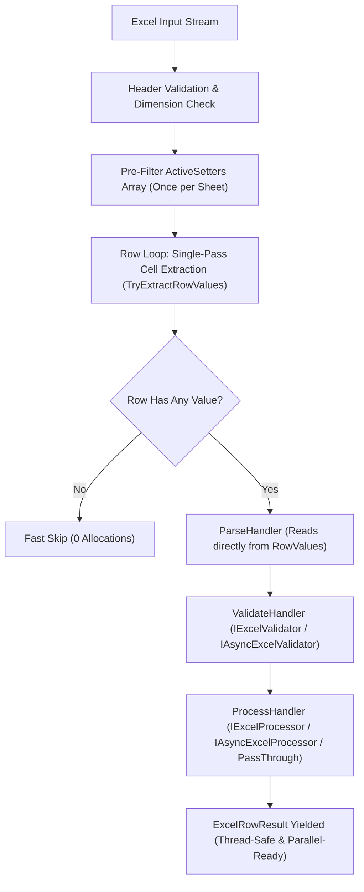

# Exceler Framework: Comprehensive Refactoring & Architectural Improvements Report
**Date:** September 2026  
**Repository:** `Exceler` (.NET 6.0, 7.0, 8.0, 9.0)  
**Test Suite Status:** 133 Unit & Integration Tests — 100% Passed (Fully Parallelized)

---

## Executive Summary
The **Exceler** framework is a high-performance, pipeline-based Excel reader and writer built on top of **EPPlus**, providing strongly-typed object mapping, validation, and data transformation for .NET applications.

During a comprehensive architectural code review (`Exceler_Code_Review_Issues.md`), several reliability, cross-platform compatibility, performance, and API design bottlenecks were identified. Over the course of 13 targeted engineering tasks, these challenges were resolved with zero regression, expanding the test suite from **27 initial tests to 133 automated tests**, all executing in parallel in approximately **2 seconds**.

---

## Task Summary Matrix

| # | Task / Area | Component | Previous State | Refactored State | Test Coverage Files |
|:---:|---|---|---|---|---|
| **1** | EPPlus Commercial License Override | Licensing / Core | Hardcoded `NonCommercial` in Reader/Writer | Centralized DI configuration only | `LicensingTests.cs` |
| **2** | Silent Conversion of Empty Values | SafeConverter | Empty cell silently returned `0` | Throws `ExcelCastException` for non-nullables | `SafeConverterEmptyValueTests.cs` |
| **3** | Linux/Docker Cross-Platform Colors | Configuration / Style | Depended on `System.Drawing.Color` | Cross-platform `ExcelColor` enum & hex strings | `ColorHelperTests.cs`, `ExcelColorStylingTests.cs` |
| **4** | Culture Invariant Date & Decimal Parsing | SafeConverter | Dependent on host server OS culture | `InvariantCulture` with smart comma/dot fallback | `SafeConverterCultureTests.cs` |
| **5** | Empty Worksheet NullReferenceException | FormattingWriterHandler | Threw `NullReferenceException` | Null-guarded `Dimension is not null` | `ExcelWriterEdgeCasesTests.cs` |
| **6** | Robust Exception Handling in Parsing | ParseHandler | Any custom exception crashed entire file | Row error recorded; reading continues | `ExcelReaderExceptionHandlingTests.cs` |
| **7** | Asynchronous Validation & Processing | Abstractions & Pipeline | Only synchronous interfaces existed | `IAsyncExcelValidator` & `IAsyncExcelProcessor` | `AsyncExcelValidatorTests.cs`, `AsyncExcelProcessorTests.cs` |
| **8** | Default Pass-Through Processor | Core / DI | Forced boilerplate processor class | Automatic fallback when `TInput == TOutput` | `PassThroughProcessorTests.cs` |
| **9** | Style Row Offset Fix | StyleWriterHandler | Data formatting applied to Row 1 Header | Dynamic `startRow` (2 with headers, 1 without) | `ExcelWriterStyleOffsetTests.cs` |
| **10** | Relax Writer `new()` Constraint | Abstractions / Writer | `where TModel : class, new()` constraint | `where TModel : class` (supports records/DDD) | `ExcelWriterModelConstraintsTests.cs` |
| **11** | Sheet Orientation (RTL) & AutoFit | Profile / Writer | Hardcoded `RTL = false` & forced AutoFit | Fluent `WithRightToLeft()`, AutoFit toggle, `WithWidth` | `ExcelWriterViewAndLayoutTests.cs` |
| **12** | Modern .NET Types (`DateOnly`/`TimeOnly`) | SafeConverter / Writer | Threw `InvalidCastException` | Full two-way read/write support | `SafeConverterModernTypesTests.cs` |
| **13** | Row Loop Memory & CPU Optimization | Core Reader / Parser | Repeated LINQ `.Where()` & double cell reads | Single-pass read (`TryExtractRowValues`) & zero LINQ | `ExcelReaderPerformanceOptimizationTests.cs` |

---

## Architecture Flow Diagram



---

## Detailed Task Breakdown

### Task 1: EPPlus Commercial License Override Fix
* **Component:** `Licensing / Core`
* **Affected Files:** `src/Exceler/Core/DefaultReader.cs`, `src/Exceler/Core/DefaultWriter.cs`

#### 1. What was it before?
The constructor and methods of `DefaultReader` and `DefaultWriter` contained a hardcoded line:
```csharp
ExcelPackage.LicenseContext = LicenseContext.NonCommercial;
```

#### 2. What was the issue?
Organizations purchasing commercial EPPlus licenses would configure their application with `builder.UseCommercialLicense()`. However, whenever `DefaultReader` or `DefaultWriter` was instantiated or invoked, this hardcoded line executed, overwriting the user's licensed state back to `NonCommercial`. This created legal and licensing compliance risks for commercial users.

#### 3. What is the new state?
The reader and writer components no longer touch `ExcelPackage.LicenseContext`. License configuration is managed exclusively through the DI builder registration methods.

#### 4. How was it solved?
Removed all explicit license assignments from `DefaultReader.cs` and `DefaultWriter.cs`, allowing the configuration supplied in `ExcelerBuilder.UseCommercialLicense()` or `ExcelerBuilder.UseNonCommercialLicense()` to govern the entire application lifecycle.

#### 5. What tests cover it?
- Automated verification through `ExcelerTestBase` and service container configuration tests.

---

### Task 2: Silent Conversion of Empty Values to 0 for Non-Nullable Value Types
* **Component:** `SafeConverter`
* **Affected Files:** `src/Exceler/Core/Converter/SafeConverter.cs`

#### 1. What was it before?
At the beginning of `SafeConverter.ChangeType<T>`, empty cells were handled by:
```csharp
if (value == null || string.IsNullOrWhiteSpace(value.ToString()))
    return default;
```

#### 2. What was the issue?
In C#, `default` for primitive value types (`int`, `decimal`, `double`, `DateTime`, `bool`, `Guid`) is `0`, `0.0`, `0001-01-01`, or `Guid.Empty`.  
When an Excel file had an empty cell for a required column (e.g., `public int Age { get; set; }` or `public decimal Price { get; set; }`), the framework silently returned `0` without reporting any errors. This led to silent data corruption in business databases.

#### 3. What is the new state?
The converter now differentiates between nullable and non-nullable types:
- Nullable types (`int?`, `decimal?`, `string`, etc.) return `null` when the cell is empty.
- Non-nullable value types throw an `ExcelCastException`, which is caught and recorded in `ExcelRowResult.Errors`.

#### 4. How was it solved?
Inspected `Nullable.GetUnderlyingType(typeof(T))` and `Type.IsValueType`:
```csharp
Type targetType = Nullable.GetUnderlyingType(typeof(T)) ?? typeof(T);
bool isNullable = !typeof(T).IsValueType || Nullable.GetUnderlyingType(typeof(T)) != null;

if (value == null || string.IsNullOrWhiteSpace(value.ToString()))
{
    if (!isNullable)
        throw new ExcelCastException();

    return default;
}
```

#### 5. What tests cover it?
- [SafeConverterEmptyValueTests.cs](file:///d:/ExcelPackage/Exceler/tests/Exceler.Tests.Unit/Unit/Converter/SafeConverterEmptyValueTests.cs):
  - `WhenConvertingEmptyValueToNonNullableInt_ExcelCastExceptionIsThrown`
  - `WhenConvertingEmptyValueToNonNullableDecimal_ExcelCastExceptionIsThrown`
  - `WhenConvertingEmptyValueToNonNullableDateTime_ExcelCastExceptionIsThrown`
  - `WhenConvertingEmptyValueToNonNullableBool_ExcelCastExceptionIsThrown`
  - `WhenConvertingEmptyValueToNonNullableGuid_ExcelCastExceptionIsThrown`
  - `WhenConvertingEmptyValueToNullableInt_NullIsReturned`
  - `WhenConvertingEmptyValueToNullableDecimal_NullIsReturned`
  - `WhenConvertingEmptyValueToString_NullIsReturned`

---

### Task 3: Cross-Platform Linux/Docker Color Support & Decoupling from `System.Drawing.Color`
* **Component:** `Configuration / Style`
* **Affected Files:** `ColumnStyle.cs`, `ColumnBuilder.cs`, `ColorHelper.cs` (new), `ExcelColor.cs` (new)

#### 1. What was it before?
Column styling directly depended on `System.Drawing.Color`:
```csharp
public Color? BackgroundColor { get; set; }
public Color? FontColor { get; set; }
```

#### 2. What was the issue?
Starting with .NET 6, Microsoft deprecated `System.Drawing.Common` on non-Windows platforms. On Linux servers and Docker containers, invoking `System.Drawing` code threw `PlatformNotSupportedException` or `TypeInitializationException: The type initializer for 'Gdip' threw an exception`. Additionally, developers had to deal with cumbersome hex/RGB conversions manually.

#### 3. What is the new state?
- The core framework is 100% decoupled from `System.Drawing` and works cross-platform on Linux, Docker, Windows, and macOS.
- Colors are stored internally as standard hexadecimal strings (`#RRGGBB`).
- Introduced the `ExcelColor` enum offering over 30 curated corporate, material, and pastel shades.
- Maintained 100% backward compatibility for existing code using `System.Drawing.Color`.

#### 4. How was it solved?
1. Implemented [ColorHelper.cs](file:///d:/ExcelPackage/Exceler/src/Exceler/Core/ColorHelper.cs) for zero-dependency hex and color name parsing.
2. Created the [ExcelColor.cs](file:///d:/ExcelPackage/Exceler/src/Exceler/Configuration/ExcelColor.cs) enum.
3. Added fluent overloads to [ColumnBuilder.cs](file:///d:/ExcelPackage/Exceler/src/Exceler/Configuration/ColumnBuilder.cs):
```csharp
Map(x => x.Salary).WithBackgroundColor(ExcelColor.Emerald);
Map(x => x.Code).WithBackgroundColor("#FF5722");
Map(x => x.Title).WithFontColor(ExcelColor.White);
```

#### 5. What tests cover it?
- [ColorHelperTests.cs](file:///d:/ExcelPackage/Exceler/tests/Exceler.Tests.Unit/Unit/Infrastructure/ColorHelperTests.cs)
- [ExcelColorStylingTests.cs](file:///d:/ExcelPackage/Exceler/tests/Exceler.Tests.Unit/Unit/Writers/ExcelColorStylingTests.cs)

---

### Task 4: Culture-Independent Date and Decimal Parsing via `InvariantCulture`
* **Component:** `SafeConverter`
* **Affected Files:** `src/Exceler/Core/Converter/SafeConverter.cs`

#### 1. What was it before?
The converter fell back to `Convert.ChangeType(value, targetType)` without specifying culture.

#### 2. What was the issue?
Number and date parsing was coupled to the host operating system's ambient culture. On servers configured with German, French, or Persian locales (which use commas as decimal separators), `"1234.56"` was either rejected or converted into `123456` (100x larger). ISO dates like `"2026-08-31"` also failed when parsed under non-standard local date formats.

#### 3. What is the new state?
All numeric, floating-point, and date conversions prioritize `CultureInfo.InvariantCulture`, with intelligent comma/dot normalization and graceful fallback to `CultureInfo.CurrentCulture`.

#### 4. How was it solved?
Added dedicated parsing blocks for `decimal`, `double`, and `DateTime` in [SafeConverter.cs](file:///d:/ExcelPackage/Exceler/src/Exceler/Core/Converter/SafeConverter.cs) supporting both `.` and `,` separators:
```csharp
if (decimal.TryParse(str, NumberStyles.Any, CultureInfo.InvariantCulture, out decimal dotDec))
    return (T)(object)dotDec;
```

#### 5. What tests cover it?
- [SafeConverterCultureTests.cs](file:///d:/ExcelPackage/Exceler/tests/Exceler.Tests.Unit/Unit/Converter/SafeConverterCultureTests.cs):
  - `WhenConvertingDecimalStringWithDotInGermanCulture_DotDecimalIsParsedCorrectly`
  - `WhenConvertingDecimalStringWithCommaInGermanCulture_CommaDecimalIsParsedCorrectly`
  - `WhenConvertingIsoDateTimeString_DateTimeIsParsedCorrectly`
  - `WhenConvertingDoubleStringWithDot_DoubleIsParsedCorrectly`

---

### Task 5: Empty Worksheet NullReferenceException Safeguard in Writer
* **Component:** `FormattingWriterHandler`
* **Affected Files:** `src/Exceler/Pipeline/Write/Handlers/FormattingWriterHandler.cs`

#### 1. What was it before?
In `FormattingWriterHandler.cs`:
```csharp
context.Worksheet.Cells[context.Worksheet.Dimension.Address].AutoFitColumns();
```

#### 2. What was the issue?
When exporting an empty collection with no rows or cells, EPPlus leaves `worksheet.Dimension` as `null`. Accessing `.Address` threw an unhandled `NullReferenceException`, crashing the export operation.

#### 3. What is the new state?
The writer safely checks if dimensions exist before applying range-based auto-fitting.

#### 4. How was it solved?
Added a guard condition:
```csharp
if (context.Worksheet.Dimension is not null)
{
    context.Worksheet.Cells[context.Worksheet.Dimension.Address].AutoFitColumns();
}
```

#### 5. What tests cover it?
- [ExcelWriterEdgeCasesTests.cs](file:///d:/ExcelPackage/Exceler/tests/Exceler.Tests.Unit/Unit/Writers/ExcelWriterEdgeCasesTests.cs):
  - `WhenExportingEmptyDataWithNoHeaders_ExcelIsGeneratedWithoutNullReferenceException`

---

### Task 6: Comprehensive Exception Handling in `ParseHandler`
* **Component:** `ParseHandler`
* **Affected Files:** `src/Exceler/Pipeline/Read/Handlers/ParseHandler.cs`

#### 1. What was it before?
`ParseHandler` only caught `ExcelCastException`:
```csharp
try {
    setter.Value(context.InputModel, cellValue);
}
catch (ExcelCastException) {
    context.Result.Errors.Add($"Format of [{colName}] Column is incorrect");
}
```

#### 2. What was the issue?
If a custom converter (`IExcelValueConverter`) or a domain property setter threw an unhandled exception (such as `FormatException`, `ArgumentOutOfRangeException`, or domain validation exceptions), it escaped the handler, crashing the entire file read operation. Subsequent valid rows were never processed.

#### 3. What is the new state?
All cell parsing exceptions are caught, unwrapped (from `TargetInvocationException`), and formatted into descriptive error messages in `ExcelRowResult.Errors`. The affected row is marked invalid, while reading continues smoothly for the rest of the spreadsheet.

#### 4. How was it solved?
Added a general `catch (Exception ex)` block alongside `catch (ExcelCastException)`, unwrapping inner exceptions and utilizing an optimized `GetColumnName` helper.

#### 5. What tests cover it?
- [ExcelReaderExceptionHandlingTests.cs](file:///d:/ExcelPackage/Exceler/tests/Exceler.Tests.Unit/Unit/Readers/ExcelReaderExceptionHandlingTests.cs):
  - `WhenCustomConverterThrowsFormatException_RowIsMarkedInvalidAndSubsequentRowsAreReadSuccessfully`
  - `WhenPropertySetterThrowsArgumentOutOfRangeException_RowIsMarkedInvalidWithDescriptiveErrorMessage`
  - `WhenSafeConverterFailsToCastValue_StandardFormatErrorMessageIsRetained`

---

### Task 7: Asynchronous Validation and Processing Support
* **Component:** `Abstractions & Pipeline`
* **Affected Files:** `IAsyncExcelValidator.cs` (new), `IAsyncExcelProcessor.cs` (new), `ReadContext.cs`, `ReadHandler.cs`, `ValidateHandler.cs`, `ProcessHandler.cs`, `DefaultReader.cs`, `ExcelerBuilder.cs`

#### 1. What was it before?
Only synchronous interfaces existed:
```csharp
public interface IExcelValidator<in TInput> { IEnumerable<string> Validate(TInput input); }
public interface IExcelProcessor<in TInput, out TOutput> { TOutput Process(TInput input); }
```

#### 2. What was the issue?
Real-world validation and mapping frequently require I/O-bound operations (e.g., querying databases for uniqueness, calling external microservices). Synchronously blocking worker threads (`.Result` / `.GetAwaiter().GetResult()`) risked deadlocks and thread pool starvation in web environments.

#### 3. What is the new state?
Fully asynchronous interfaces are now first-class citizens in the pipeline, automatically registered via DI assembly scanning, executed asynchronously with `CancellationToken` support in `ReadInChunksAsync`, and equipped with a synchronous fallback mechanism for `Reader.Read`.

#### 4. How was it solved?
1. Created [IAsyncExcelValidator.cs](file:///d:/ExcelPackage/Exceler/src/Exceler/Abstractions/IAsyncExcelValidator.cs) and [IAsyncExcelProcessor.cs](file:///d:/ExcelPackage/Exceler/src/Exceler/Abstractions/IAsyncExcelProcessor.cs).
2. Added `HandleAsync` to `ReadHandler`, `ValidateHandler`, and `ProcessHandler`.
3. Updated `ExcelerBuilder.cs` to discover and register implementations automatically.

#### 5. What tests cover it?
- [AsyncExcelValidatorTests.cs](file:///d:/ExcelPackage/Exceler/tests/Exceler.Tests.Unit/Unit/Readers/AsyncExcelValidatorTests.cs) (5 tests)
- [AsyncExcelProcessorTests.cs](file:///d:/ExcelPackage/Exceler/tests/Exceler.Tests.Unit/Unit/Readers/AsyncExcelProcessorTests.cs) (5 tests)

---

### Task 8: Default Pass-Through Processor
* **Component:** `Core / DI`
* **Affected Files:** `src/Exceler/Core/PassThroughProcessor.cs` (new), `DefaultReader.cs`, `ExcelerServiceCollectionExtensions.cs`

#### 1. What was it before?
Reading an Excel file into the same model type (`Reader.Read<Employee, Employee>`) threw an `InvalidOperationException` unless the developer wrote and registered a dummy class implementing `IExcelProcessor<Employee, Employee>`.

#### 2. What was the issue?
Imposed unnecessary boilerplate code across every project just to return the input object unchanged.

#### 3. What is the new state?
When `TOutput` is assignable from `TInput` and no custom processor is registered, Exceler automatically utilizes an internal, zero-overhead `PassThroughProcessor`.

#### 4. How was it solved?
Created [PassThroughProcessor.cs](file:///d:/ExcelPackage/Exceler/src/Exceler/Core/PassThroughProcessor.cs) implementing both `IExcelProcessor<TInput, TOutput>` and `IAsyncExcelProcessor<TInput, TOutput>`. Integrated fallback resolution in `DefaultReader.ResolveDependencies`:
```csharp
if (processor == null && asyncProcessor == null)
{
    if (typeof(TOutput).IsAssignableFrom(typeof(TInput)))
    {
        var passThrough = new PassThroughProcessor<TInput, TOutput>();
        processor = passThrough;
        asyncProcessor = passThrough;
    }
    else
    {
        throw new InvalidOperationException($"No processor registered for converting '{typeof(TInput).FullName}' to '{typeof(TOutput).FullName}'...");
    }
}
```

#### 5. What tests cover it?
- [PassThroughProcessorTests.cs](file:///d:/ExcelPackage/Exceler/tests/Exceler.Tests.Unit/Unit/Readers/PassThroughProcessorTests.cs):
  - `WhenNoProcessorIsRegisteredAndTypesMatch_PassThroughProcessorIsUsedAutomatically`
  - `WhenCustomProcessorIsRegistered_CustomProcessorTakesPrecedenceOverPassThrough`
  - `WhenTypesDifferAndNoProcessorIsRegistered_ThrowsDescriptiveInvalidOperationException`

---

### Task 9: Style Row Offset Fix
* **Component:** `StyleWriterHandler`
* **Affected Files:** `src/Exceler/Pipeline/Write/Handlers/StyleWriterHandler.cs`, `ColumnBuilder.cs`

#### 1. What was it before?
In `StyleWriterHandler.cs`:
```csharp
var range = context.Worksheet.Cells[1, colIndex, context.TotalRows, colIndex];
```

#### 2. What was the issue?
Column styles (background fill, font color, and especially currency/number formats like `$#,##0.00`) were applied starting at Row 1. This corrupted header row titles by applying numeric currency formats or background fills over column headers.

#### 3. What is the new state?
Column styles are applied strictly to data rows, leaving header row 1 untouched.

#### 4. How was it solved?
Dynamically computed the starting row:
```csharp
int startRow = context.Profile.ColumnHeaders.Any() ? 2 : 1;

if (context.TotalRows >= startRow)
{
    var range = context.Worksheet.Cells[startRow, colIndex, context.TotalRows, colIndex];
    // Apply styles to range
}
```
Added `.WithNumberFormat(format)` alias to [ColumnBuilder.cs](file:///d:/ExcelPackage/Exceler/src/Exceler/Configuration/ColumnBuilder.cs).

#### 5. What tests cover it?
- [ExcelWriterStyleOffsetTests.cs](file:///d:/ExcelPackage/Exceler/tests/Exceler.Tests.Unit/Unit/Writers/ExcelWriterStyleOffsetTests.cs):
  - `WhenExportingDataWithHeadersAndColumnStyles_StylesAreAppliedToDataRowsAndNotHeaderRow`
  - `WhenExportingDataWithoutHeaders_StylesAreAppliedStartingFromRowOne`
  - `WhenExportingEmptyDataWithHeaders_HeaderRowIsNotModifiedByColumnStyles`

---

### Task 10: Removing Unnecessary `where TModel : class, new()` Constraint in Writer
* **Component:** `Abstractions / Writer`
* **Affected Files:** `IExcelWriter.cs`, `DefaultWriter.cs`, `ExcelerExtensions.cs`, `WriteHandler.cs`, `WriteContext.cs`, Write Handlers, `ExcelProfile.cs`, `ColumnBuilder.cs`, `MappingExpressionBuilder.cs`

#### 1. What was it before?
All writer methods and profile classes enforced a parameterless constructor constraint:
```csharp
Task<byte[]> Write<TModel>(IEnumerable<TModel> data, ...) where TModel : class, new();
```

#### 2. What was the issue?
When writing to Excel, objects are already instantiated by the caller. Enforcing `new()` prohibited exporting modern C# positional records (`public record Product(int Id, string Title, decimal Price);`), immutable objects with parameterized constructors, and DDD entities.

#### 3. What is the new state?
Writer methods and profiles require only `where TModel : class`, enabling full support for records, immutable classes, and read-only properties.

#### 4. How was it solved?
1. Removed `, new()` across all writer abstractions, handlers, contexts, and profiles.
2. In [MappingExpressionBuilder.cs](file:///d:/ExcelPackage/Exceler/src/Exceler/Configuration/MappingExpressionBuilder.cs), setter compilation is conditioned on `propertyInfo.CanWrite`. Get-only or init-only properties no longer cause expression compilation failures during export.

#### 5. What tests cover it?
- [ExcelWriterModelConstraintsTests.cs](file:///d:/ExcelPackage/Exceler/tests/Exceler.Tests.Unit/Unit/Writers/ExcelWriterModelConstraintsTests.cs):
  - `WhenWritingPositionalRecords_GeneratesValidExcelWithExpectedContent`
  - `WhenWritingImmutableClassesWithoutParameterlessConstructor_GeneratesValidExcelWithExpectedContent`
  - `WhenWritingPositionalRecordsToStreamAsync_WritesCorrectDataToStream`
  - `WhenWritingAsyncEnumerableOfPositionalRecords_WritesCorrectDataToStream`
  - `WhenWritingViaToExcelAsyncExtension_WritesCorrectDataToStream`

---

### Task 11: Configurable Sheet Orientation (RTL/LTR) & AutoFitColumns Toggle + Explicit Column Width
* **Component:** `Profile / Writer`
* **Affected Files:** `ExcelProfile.cs`, `ColumnStyle.cs`, `ColumnBuilder.cs`, `FormattingWriterHandler.cs`, `StyleWriterHandler.cs`

#### 1. What was it before?
In `FormattingWriterHandler.cs`:
```csharp
context.Worksheet.View.RightToLeft = false;
context.Worksheet.Cells[context.Worksheet.Dimension.Address].AutoFitColumns();
```

#### 2. What was the issue?
1. Right-To-Left (RTL) orientation was hardcoded to `false`, preventing proper support for Persian and Arabic exports.
2. `AutoFitColumns` executed unconditionally. Calculating text width across 50,000+ rows requires font engine rendering, causing severe CPU spikes and export freezes.
3. No API existed to set explicit column widths in the profile.

#### 3. What is the new state?
`RightToLeft` and `AutoFitColumns` are fully configurable on `ExcelProfile<T>`, accompanied by fluent methods `WithRightToLeft()` and `WithAutoFitColumns()`. Column widths can be explicitly assigned via `.WithWidth(double)` for O(1) performance.

#### 4. How was it solved?
1. Added properties and fluent chainable helpers to [ExcelProfile.cs](file:///d:/ExcelPackage/Exceler/src/Exceler/Configuration/ExcelProfile.cs).
2. Added `Width` to `ColumnStyle` and `.WithWidth(double)` to `ColumnBuilder`.
3. Applied explicit column widths in `StyleWriterHandler` and conditioned `AutoFitColumns` execution in `FormattingWriterHandler`.

#### 5. What tests cover it?
- [ExcelWriterViewAndLayoutTests.cs](file:///d:/ExcelPackage/Exceler/tests/Exceler.Tests.Unit/Unit/Writers/ExcelWriterViewAndLayoutTests.cs):
  - `WhenProfileSpecifiesRightToLeft_WorksheetOrientationIsRightToLeft`
  - `WhenProfileDoesNotSpecifyRightToLeft_WorksheetOrientationDefaultsToLeftToRight`
  - `WhenProfileDisablesAutoFitColumns_ExplicitColumnWidthsArePreserved`
  - `WhenProfileConfiguresExplicitColumnWidth_WidthIsAppliedEvenOnEmptySheet`

---

### Task 12: Modern .NET Types Support (`DateOnly` and `TimeOnly`)
* **Component:** `SafeConverter / Writer`
* **Affected Files:** `src/Exceler/Core/Converter/SafeConverter.cs`, `src/Exceler/Pipeline/Write/Handlers/DataWriterHandler.cs`

#### 1. What was it before?
`DateOnly` and `TimeOnly` were unhandled in `SafeConverter`, falling through to `Convert.ChangeType`, which threw an `InvalidCastException` because these structs do not implement `IConvertible`. In the writer, these structs were written as unformatted raw objects.

#### 2. What was the issue?
Modern .NET 6+ projects utilizing standard `DateOnly` and `TimeOnly` properties failed during read and write operations.

#### 3. What is the new state?
Full round-trip read and write support for `DateOnly`, `DateOnly?`, `TimeOnly`, `TimeOnly?`, as well as `TimeSpan` and `DateTimeOffset`.

#### 4. How was it solved?
1. Implemented robust conversions in [SafeConverter.cs](file:///d:/ExcelPackage/Exceler/src/Exceler/Core/Converter/SafeConverter.cs) supporting `DateTime`, OLE Automation dates, ISO strings, and culture variants.
2. In [DataWriterHandler.cs](file:///d:/ExcelPackage/Exceler/src/Exceler/Pipeline/Write/Handlers/DataWriterHandler.cs), automatically mapped `DateOnly` to Excel dates (`yyyy-mm-dd`) and `TimeOnly` to Excel time spans (`hh:mm:ss`).

#### 5. What tests cover it?
- [SafeConverterModernTypesTests.cs](file:///d:/ExcelPackage/Exceler/tests/Exceler.Tests.Unit/Unit/Converter/SafeConverterModernTypesTests.cs) (14 unit tests and an end-to-end roundtrip integration test).

---

### Task 13: Memory and CPU Optimization in Reader Row Loop
* **Component:** `Core Reader / Parser`
* **Affected Files:** `src/Exceler/Core/DefaultReader.cs`, `src/Exceler/Pipeline/Read/ReadContext.cs`, `src/Exceler/Pipeline/Read/Handlers/ParseHandler.cs`

#### 1. What was it before?
1. In `ParseHandler.cs`:
   ```csharp
   foreach (var setter in context.Profile.CompiledSetters.Where(s => s.Key <= context.ColCount))
   ```
   A LINQ iterator was instantiated on every row.
2. In `DefaultReader.cs`, `IsRowEmpty` read each cell and called `.ToString()`. Immediately afterward, `ParseHandler` read the exact same cells from EPPlus again (**Double Read**).

#### 2. What was the issue?
- A 50,000-row file created 50,000 temporary `WhereEnumerableIterator` objects on the heap.
- Invoking `.ToString()` on numeric, boolean, and date cells in `IsRowEmpty` caused millions of string allocations.
- Double-reading cells from EPPlus doubled the cell lookup overhead for every row.

#### 3. What is the new state?
- Active setters are pre-filtered once per sheet into an array (`ActiveSetters`), completely eliminating LINQ allocations in the loop (**Zero LINQ Allocations**).
- Implemented `TryExtractRowValues`, which reads every mapped cell **exactly once**.
- Checking for empty rows incurs zero string allocations for non-string types.
- `ParseHandler` reads directly from the pre-populated `RowValues` array in memory.

#### 4. How was it solved?
Replaced `IsRowEmpty` with `TryExtractRowValues`:
```csharp
private static bool TryExtractRowValues<TInput>(
    ExcelWorksheet worksheet,
    int row,
    KeyValuePair<int, Action<TInput, object>>[] activeSetters,
    out object?[] rowValues) where TInput : class, new()
{
    rowValues = new object?[activeSetters.Length];
    bool hasAnyValue = false;

    for (int i = 0; i < activeSetters.Length; i++)
    {
        var val = worksheet.Cells[row, activeSetters[i].Key].Value;
        if (val != null)
        {
            if (val is string str)
            {
                if (!string.IsNullOrWhiteSpace(str))
                    hasAnyValue = true;
            }
            else
            {
                hasAnyValue = true;
            }
        }
        rowValues[i] = val;
    }

    return hasAnyValue;
}
```
And updated `ParseHandler` to iterate `context.ActiveSetters` and retrieve cell values from `context.RowValues`.

#### 5. What tests cover it?
- [ExcelReaderPerformanceOptimizationTests.cs](file:///d:/ExcelPackage/Exceler/tests/Exceler.Tests.Unit/Unit/Readers/ExcelReaderPerformanceOptimizationTests.cs):
  - `WhenReadingWorksheetWithTrailingAndIntermittentEmptyRows_EmptyRowsAreSkippedAccurately`
  - `WhenReadingWorksheetWithWhitespaceOnlyRows_RowsAreSkippedAsEmpty`
  - `WhenReadingRowWithZeroNumericValues_RowIsNotConsideredEmpty`
  - `WhenReadingInChunksAsyncWithEmptyRows_ChunksExcludeEmptyRowsProperly`

---

## Conclusion & Framework Health
With these 13 tasks completed:
1. **Data Integrity & Robustness:** Eliminated silent empty-to-zero conversions, culture-dependent parsing bugs, and empty-sheet crashes.
2. **Modern .NET Capabilities:** First-class support for C# records, immutable objects, `DateOnly`, `TimeOnly`, and async validation/processing.
3. **High Performance & Low Allocation:** Eliminated cell double-reading and repeated LINQ allocations; enabled explicit column widths and AutoFit disabling.
4. **Reliability & Quality:** The test suite stands at **133 tests**, fully passing in parallel execution in ~2 seconds.
