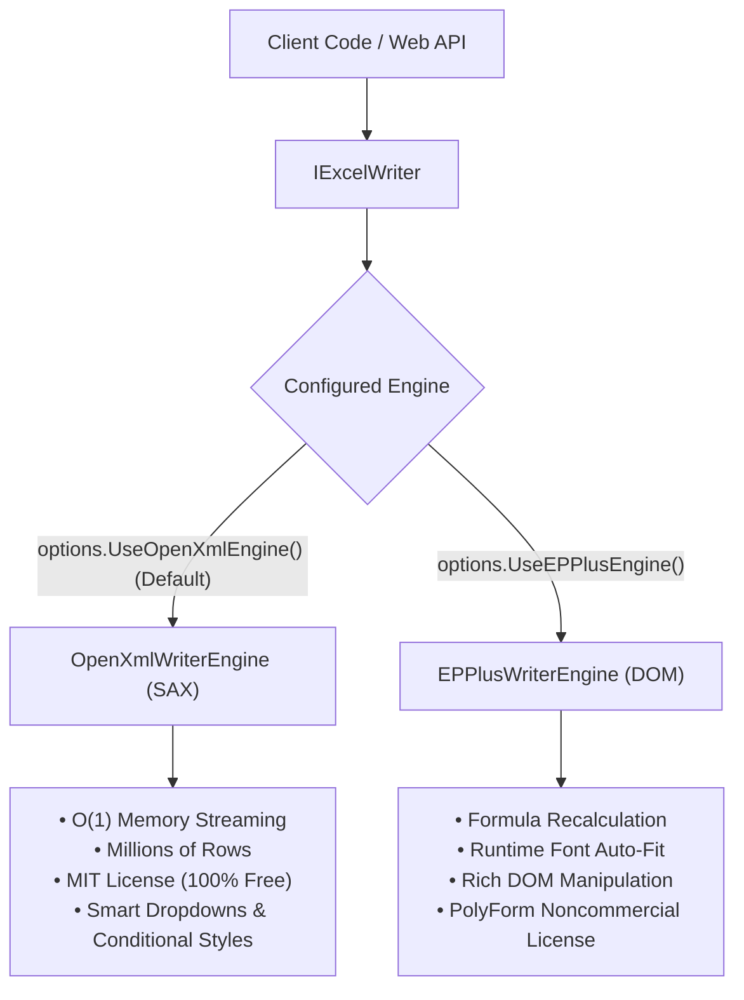

<p align="center">
  
</p>

# 🚀 Exceler

[](https://www.nuget.org/packages/Exceler)
[](https://www.nuget.org/packages/Exceler)
[](#)
[](LICENSE)
[](https://codecov.io/gh/AmirMahdiyar/Exceler)

> 💡 **Enterprise Guarantee:** With Exceler's OpenXML engine, your background export jobs and API microservices maintain a flat, predictable memory profile regardless of whether you export 500 rows or 2,000,000 rows.

---

## ⚡ Core Features & Capabilities

Exceler combines peak performance with an elegant, fluent Developer Experience (DX):

*   **Zero-Allocation Mapping Pipeline:** Eliminates boxing and runtime reflection by compiling mapping configurations into high-performance **Expression Trees** at application startup. Row mapping executes at the raw speed of handwritten, hard-coded C# code.
*   **Dual-Engine Flexibility:** Choose between the ultra-lightweight **OpenXML SAX Engine** (default, low-memory, MIT) and the rich **EPPlus DOM Engine** (formula recalculations, font metrics) via standard dependency injection.
*   **Direct EF Core Streaming:** Stream database queries row-by-row directly into Excel using `IAsyncEnumerable<T>` and the `.ToExcelAsync()` extension without ever buffering giant lists in RAM with `.ToListAsync()`.
*   **Lazy Chunked Importing:** Employs lazy deferred execution (`IEnumerable` streaming) and asynchronous chunking (`ReadInChunksAsync` via `IAsyncEnumerable`) to deliver processed rows on-demand, minimizing Garbage Collector (GC) pressure.
*   **Production-Ready Pipelines:** Built-in support for strongly-typed value conversion (`IExcelValueConverter<T>`), asynchronous business rule validation (`IAsyncExcelValidator<T>`), asynchronous domain enrichment (`IAsyncExcelProcessor<TIn, TOut>`), and Right-to-Left (RTL) worksheets.
*   **Smart Dropdowns (Data Validation):** Embed validation pickers to eliminate user typos in import templates, complete with custom error alerts and input prompts.
*   **Pure C# Conditional Formatting:** Type-safe styling using C# lambdas rather than localized, brittle Excel formula strings.
*   **Bulletproof Parsing:** Built-in safeguards against corrupt files, formula-based cells, type mismatches, unexpected nulls, and duplicate or missing headers.

---

## 🧠 Dual-Engine Architecture: OpenXML SAX vs. EPPlus

Exceler provides two interchangeable write engines behind a unified `IExcelWriter` interface:



1.  **OpenXML SAX Engine (Recommended for Exports):**
    *   Streams directly to XML without building an in-memory document tree.
    *   Flawless performance on memory-constrained containers, Docker, and Kubernetes pods.
    *   100% MIT licensed.
2.  **EPPlus DOM Engine:**
    *   Ideal for scenarios requiring in-memory formula calculation or runtime font-metric column auto-fitting.
    *   Requires PolyForm Noncommercial compliance in commercial environments.

---

## 📦 Installation

Install Exceler via the NuGet Package Manager or .NET CLI:

```bash
dotnet add package Exceler
```

---

## 🚀 Quick Start

Implement high-performance spreadsheet import and export in just a few clean steps:

### Step 1: Register Core Services

```csharp
// Program.cs
using Exceler.DependencyInjection;

var builder = WebApplication.CreateBuilder(args);

// Register Exceler services and automatically scan assemblies for profiles
builder.Services.AddExcelCore(options =>
{
    // Option A: Use the high-performance OpenXML SAX Engine for exports (Default - O(1) memory, MIT)
    options.UseOpenXmlEngine();

    // ⚠️ Required if reading/importing Excel files via IExcelReader (EPPlus backend):
    options.UseNonCommercialLicense(); // or .UseCommercialLicense()

    // Option B: Or use the EPPlus DOM Engine for exports if formula recalculation is needed
    // options.UseEPPlusEngine().UseNonCommercialLicense();

    options.RegisterFromAssemblyContaining<OrderExportProfile>();
});
```

---

### Step 2: Define Model and Fluent Mapping Profile

Map your models declaratively with full support for column widths, colors, smart dropdowns, and conditional styles:

```csharp
using Exceler.Configuration;

public class OrderExportModel
{
    public int Id { get; set; }
    public string OrderNumber { get; set; } = string.Empty;
    public string CustomerName { get; set; } = string.Empty;
    public string Country { get; set; } = string.Empty;
    public decimal TotalAmount { get; set; }
    public OrderStatus Status { get; set; }
    public bool IsExpressDelivery { get; set; }
}

public class OrderExportProfile : ExcelProfile<OrderExportModel>
{
    public OrderExportProfile()
    {
        WithAutoFitColumns(false); // Optimized for O(1) streaming throughput

        // 1. Row-Level Conditional Styling:
        // Highlights the entire row with soft yellow for express deliveries
        WithConditionalRowStyle(
            order => order.IsExpressDelivery,
            style => style.WithBackgroundColor(ExcelColor.SoftYellow)
        );

        Map(x => x.Id)
            .ToColumn(1)
            .WithHeader("Order ID")
            .WithWidth(12)
            .IsBold();

        Map(x => x.OrderNumber)
            .ToColumn(2)
            .WithHeader("Order Number")
            .WithWidth(18);

        Map(x => x.CustomerName)
            .ToColumn(3)
            .WithHeader("Customer Name")
            .WithWidth(25)
            .WithFontColor(ExcelColor.DarkBlue);

        // 2. Smart Dropdown (Comma-Safe Reference Sheet):
        // Notice: "Tehran, Iran" contains a comma. Exceler automatically routes choices
        // to a hidden '_ValidationData' reference worksheet to prevent corrupt formula ranges!
        Map(x => x.Country)
            .ToColumn(4)
            .WithHeader("Country")
            .WithWidth(18)
            .WithDropdown(
                "United States", "Germany", "United Kingdom",
                "France", "Tehran, Iran", "Tokyo, Japan", "Sydney, Australia"
            );

        // 3. Property-Level Conditional Styling:
        // High-value orders (> $1,500) are bolded with soft green background.
        // Currency number format ($#,##0.00) is strictly preserved!
        Map(x => x.TotalAmount)
            .ToColumn(5)
            .WithHeader("Total Amount")
            .WithWidth(16)
            .WithFormat("$#,##0.00")
            .WithConditionalStyle(
                amount => amount > 1500m,
                style => style.WithBackgroundColor(ExcelColor.SoftGreen).SetBold(true)
            );

        // 4. Enum-Driven Dropdown & Model-Level Conditional Styling:
        // Cancelled orders are highlighted in soft red with dark red text.
        // On rows that are express delivery, this column rule cleanly overrides the yellow row style!
        Map(x => x.Status)
            .ToColumn(6)
            .WithHeader("Status")
            .WithWidth(14)
            .WithDropdownFromEnum<OrderStatus>()
            .WithConditionalStyle(
                order => order.Status == OrderStatus.Cancelled,
                style => style.WithBackgroundColor(ExcelColor.SoftRed).WithFontColor(ExcelColor.DarkRed).SetBold(true)
            );
    }
}
```

---

### Step 3: Fast Excel Reading (Lazy Importing & Validation)

Read incoming Excel files with deferred row evaluation, business rule validation, and custom domain enrichment.

> 💡 **License Context for Reading:** `IExcelReader` utilizes EPPlus for reading spreadsheets. You must explicitly configure your license in `AddExcelCore` (via `.UseNonCommercialLicense()` or `.UseCommercialLicense()`). Calling `Read` or `ReadInChunksAsync` without this will fail fast with a clear, helpful `InvalidOperationException`.

```csharp
using Exceler.Abstractions;
using Microsoft.AspNetCore.Mvc;

[ApiController]
[Route("api/orders")]
public class OrdersImportController : ControllerBase
{
    private readonly IExcelReader _excelReader;

    public OrdersImportController(IExcelReader excelReader)
    {
        _excelReader = excelReader;
    }

    [HttpPost("import")]
    public async Task<IActionResult> Import(IFormFile file, CancellationToken ct)
    {
        using var stream = file.OpenReadStream();
        
        // Lazy-loaded row stream. Avoids storing redundant DTO collections in memory.
        var results = _excelReader.Read<OrderImportInput, OrderDto>(stream);

        int validCount = 0;
        int errorCount = 0;

        foreach (var row in results)
        {
            if (row.IsValid)
            {
                var dto = row.Data;
                validCount++;
                // Process valid record...
            }
            else
            {
                var errors = row.Errors;
                errorCount++;
                // Log or handle validation error...
            }
        }

        return Ok(new { Valid = validCount, Errors = errorCount });
    }

    // High-volume async chunked reading for massive files:
    [HttpPost("import-chunks")]
    public async Task<IActionResult> ImportInChunks(IFormFile file, CancellationToken ct)
    {
        using var stream = file.OpenReadStream();

        await foreach (var chunk in _excelReader.ReadInChunksAsync<OrderImportInput, OrderDto>(stream, chunkSize: 5000, cancellationToken: ct))
        {
            // Process chunk of 5,000 records in batch...
        }

        return Ok();
    }
}
```

---

### Step 4: High-Volume Styled Excel Exporting

Stream large collections directly to an HTTP response stream:

```csharp
using Exceler.Abstractions;
using Microsoft.AspNetCore.Mvc;

[ApiController]
[Route("api/orders")]
public class OrdersExportController : ControllerBase
{
    private readonly IExcelWriter _excelWriter;

    public OrdersExportController(IExcelWriter excelWriter)
    {
        _excelWriter = excelWriter;
    }

    [HttpGet("export")]
    public async Task<IActionResult> Export()
    {
        var orders = await GetOrdersListAsync();

        var memoryStream = new MemoryStream();
        await _excelWriter.WriteAsync(orders, memoryStream, sheetName: "Orders");
        memoryStream.Position = 0;

        return File(
            memoryStream, 
            "application/vnd.openxmlformats-officedocument.spreadsheetml.sheet", 
            "orders.xlsx"
        );
    }
}
```

---

### Step 5: Direct Streaming from EF Core (`AsAsyncEnumerable`)

Stream database queries of **hundreds of thousands of records** directly into an Excel workbook without ever buffering giant lists in RAM with `.ToListAsync()`:

```csharp
using Exceler.Abstractions;
using Exceler.Extensions;
using Microsoft.AspNetCore.Mvc;
using Microsoft.EntityFrameworkCore;

[HttpGet("export-database-stream")]
public async Task<IActionResult> ExportDatabaseStream(
    [FromServices] AppDbContext dbContext,
    [FromServices] IExcelWriter excelWriter,
    CancellationToken ct)
{
    var memoryStream = new MemoryStream();

    // Stream records row-by-row directly from SQL into the OpenXML workbook stream!
    await dbContext.Orders
        .AsNoTracking()
        .AsAsyncEnumerable()
        .ToExcelAsync(excelWriter, memoryStream, sheetName: "Database Export", cancellationToken: ct);

    memoryStream.Position = 0;
    return File(
        memoryStream,
        "application/vnd.openxmlformats-officedocument.spreadsheetml.sheet",
        "orders_stream.xlsx"
    );
}
```

---

## 🛡️ Reliability & Enterprise Quality

Exceler is built for mission-critical enterprise workloads with zero tolerance for failure:

*   **100% Passing Automated Tests:** 346 unit and integration tests executing in ~1 second.
*   **98% Line Coverage & 94% Branch Coverage:** Exhaustively tested edge cases across all target frameworks.
*   **ECMA-376 Schema Compliance:** Ensures strict OpenXML XML element sequencing (`sheetViews` $\rightarrow$ `cols` $\rightarrow$ `sheetData` $\rightarrow$ `dataValidations`), preventing "workbook needs repair" dialogs in Excel.
*   **Bulletproof Exception Handling:** Robust parsing of corrupt values, formula evaluation fallbacks, safe type casting, and template mismatch detection.
*   **Thread-Safe Startup Compilation:** All Expression Trees and style resolvers pre-compile safely upon initialization.

---

## 📄 Licensing

*   **Exceler Core Library:** Licensed under the [MIT License](LICENSE) - free for personal, commercial, and enterprise use.
*   **OpenXML SAX Engine:** Built on Microsoft's official `DocumentFormat.OpenXml` package (MIT License) - completely free and unrestricted for enterprise production environments.
*   **EPPlus Engine:** Utilizes EPPlus under the **PolyForm Noncommercial License 1.0.0**. If utilizing `options.UseEPPlusEngine()` in a commercial setting, please ensure you comply with EPPlus commercial licensing terms.

---

## 🤝 Contributing

Contributions, issues, and feature requests are welcome! Feel free to open an issue or pull request on GitHub.
